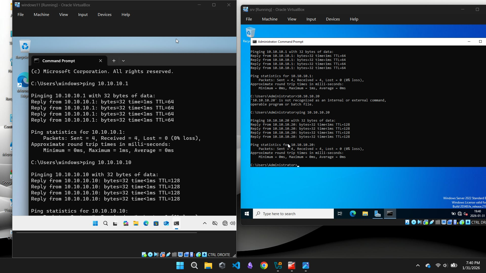
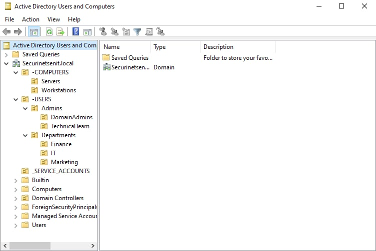

# Securinets ENIT: SOC & Enterprise Infrastructure

This project documents the deployment of a secure enterprise network. It focuses on network segmentation using **OPNsense** and identity management via **Active Directory**.

##  Project Overview
* **Domain:** `securinetsenit.local`
* **Firewall:** OPNsense (NAT/DHCP)
* **Identity:** Windows Server 2022 (AD DS, DNS)
* **Endpoints:** Windows 10

##  Infrastructure Architecture
The network is segmented into a WAN (External) and a LAN (Internal) to simulate a real-world corporate environment.

| Virtual Machine | Connection Mode |
| :--- | :--- |
| **OPNsense Firewall** | NAT / Internal Network |
| **Windows Server 2022** | Internal Network |
| **Windows 10 Client** | Internal Network |

## 🛠️ Configuration Details
* **OPNsense Root Password:** `opnsense`
* **LAN Gateway:** `10.10.10.1` (Static)
* **Client IP Assignment:** DHCP Service enabled on OPNsense LAN.

##  Security Implementation (GPOs)
We are currently implementing security hardening via Group Policy Objects, including:
* **Password Policy:** 14-character minimum and complexity enabled.
* **Account Lockout:** 5 failed attempts threshold.
* **User Restrictions:** Screen lock and restricted access to administrative tools.

##  Screenshots
All technical proofs and screenshots are located in the `/images` folder.

---
*Created by the Securinets ENIT Project Team.*
