# Deployment Report: SOC Infrastructure & Active Directory
**Project:** Enterprise Infrastructure & Security Operations Center (SOC)  
**Organization:** Securinets ENIT  
**Date:** 2026 
**Status:** Phase 2 Completed 

---

## 1. Introduction
This document serves as the technical validation report for **Phases 1 ,2 and 3**. It details the deployment of the virtualized infrastructure, network segmentation, and the configuration of the Active Directory identity core for the `securinetsenit.local` domain.

### 1.1 Project Team
* **Mouhamed Oussema Chelly** – Team Leader
* **Amir Khammar**
* **Rayen Mabsout**
* **Karim Dami**
* **Montaha Jmai**
* **Mariem Idoudi**

---

## 2. Phase 1: Infrastructure & Network Configuration
**Objective:** Establish strict segmentation between the external network (WAN) and the simulated enterprise network (LAN) using a firewall-based architecture.

### 2.1 Virtual Network Adapters
The infrastructure utilizes specific connection modes to ensure isolation and connectivity.

| Virtual Machine | Connection Mode |
| :--- | :--- |
| **OPNsense Firewall** | NAT / Internal Network |
| **Windows Server 2022** | Internal Network |
| **Windows 10 Client** | Internal Network |

### 2.2 OPNsense Interface Configuration
The OPNsense firewall acts as the central gateway.
* **WAN Interface:** Configured via **DHCP (IPv4)** to receive an upstream IP address for internet access (NAT).
* **LAN Interface:** Configured with a **Static IP** (`10.10.10.1`) to serve as the gateway.

*Credentials:*
* **User:** `root`
* **Password:** `opnsense`

**Proof of OPNsense Interface Configuration:**  
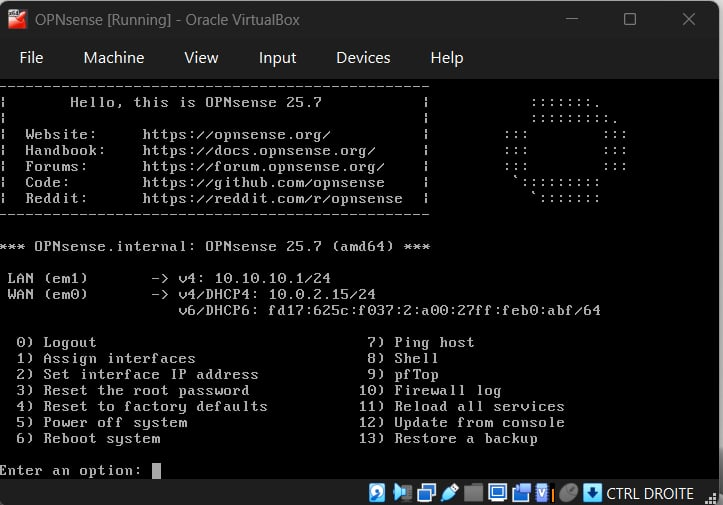

### 2.3 Internal IP Addressing (DHCP)
Instead of manual static assignment for every client, we configured a **DHCP Service** on the LAN interface.
* **Network Range:** `10.10.10.0/24`
* **DHCP Scope:** Assigns IP addresses automatically to all VMs connected to the LAN segment.
* **Gateway:** `10.10.10.1`

**Proof of IP Configuration (Server):**  
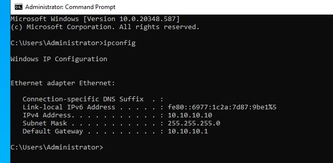

**Proof of IP Configuration (Client):**  
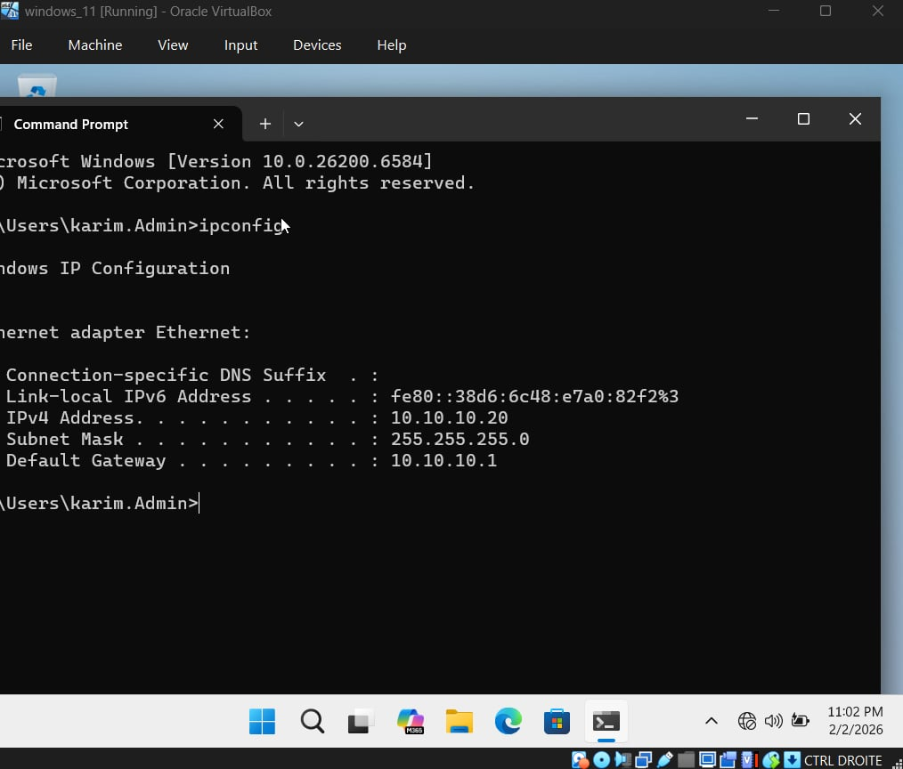

### 2.4 Connectivity Validation
To validate the routing and DHCP configuration, we performed cross-VM ping tests:
1.  **Inter-VM:** Windows 10 Client successfully pings Windows Server.
2.  **Gateway:** Both VMs successfully ping the OPNsense LAN IP (`10.10.10.1`).

**Proof of Connectivity (Ping Tests):**  

---

## 3. Phase 2: Active Directory & GPO Strategy
**Objective:** Deploy the identity management system and enforce security baselines as per the specifications.

### 3.1 Domain Configuration
* **Root Domain Name:** `securinetsenit.local`
* **Forest Functional Level:** Windows Server 2022
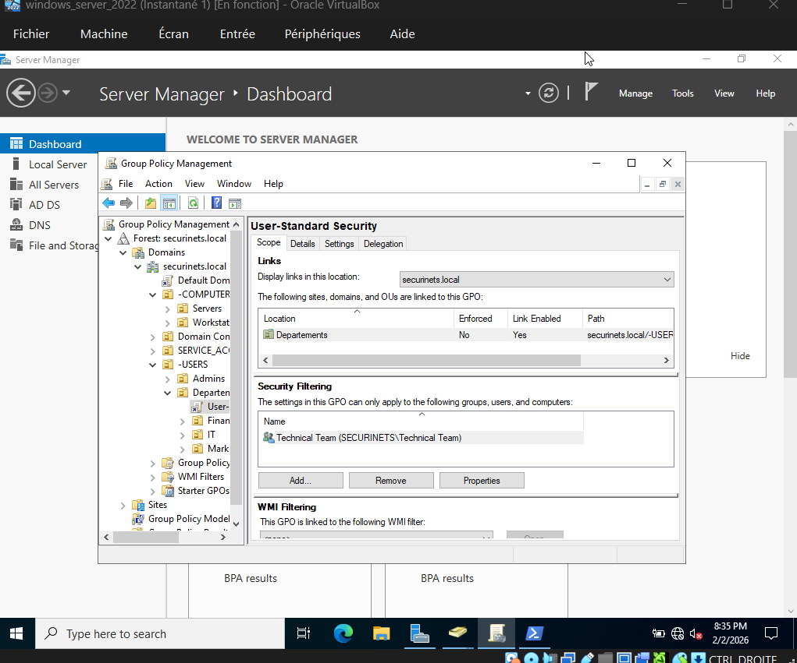

### 3.2 Organizational Unit (OU) Structure
We implemented the OU hierarchy defined in the specification to facilitate granular GPO application.

**Proof of Active Directory Structure:**  

## 3.3 Group Policy Objects (GPO) Implementation (Completed)

The Group Policy strategy has been fully implemented and verified. All security baselines are now active across the `securinetsenit.local` domain.

### A. Default Domain Policy 
* **Target:** All Users / Computers  
* **Status:** **Applied** * **Key Settings:**
    * Password Complexity: Enabled
    * Min Password Length: 14 characters
    * Lockout Threshold: 5 invalid attempts
    * Kerberos Ticket Lifetime: 10 hours

**Proof of Default Domain Policy Configuration:** 

---

### B. User Standard Security & OU Structure
* **Target:** `USERS/Departments` (Finance, Marketing, IT)  
* **Status:** **Applied** * **Settings:**
    * Enforce screen lock after **10 minutes** idle.
    * Restricted access to Control Panel and CMD for non-IT users.
    * Application of branded desktop environment.

**Proof of Group Policy Management & OU Structure:** 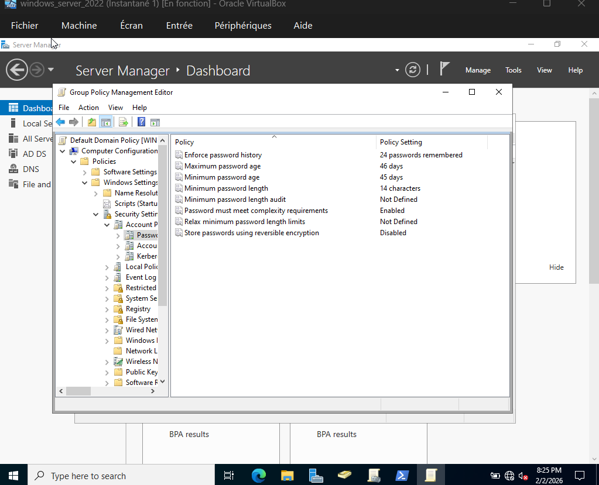

---

### C. Computer Hardening (Local & Domain Policies)
* **Target:** `COMPUTERS/Workstations`  
* **Status:** **Applied** * **Settings:**
    * Removal of local admin privileges.
    * Disabling of Guest accounts and USB Auto-run.
    * Secure channel signing enforcement.

**Proof of Local Group Policy Editor Configuration:** 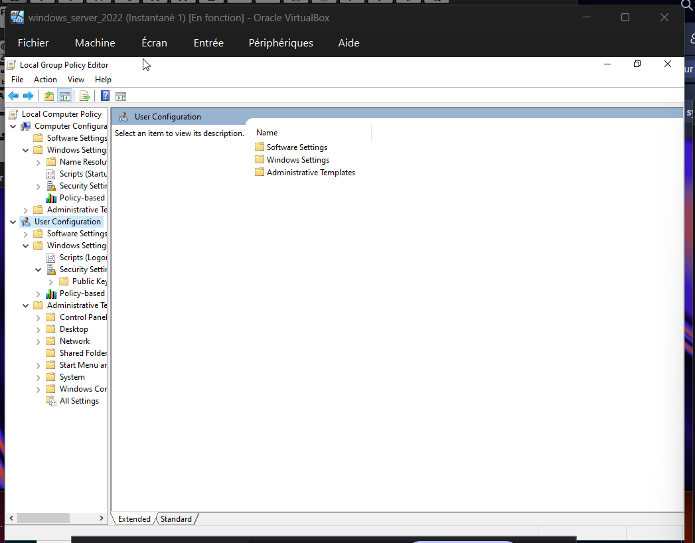

---

### D. Server Security Baseline & LDAP Hardening - Windows Defender with Advanced Security
As a critical hardening measure, we have configured **Windows Defender Firewall** via GPO to protect core services.

* **Configured Rules:** Specific Inbound/Outbound rules for **LDAP**, Domain Controller communication, and DNS resolution.
* **Objective:** Prevent unauthorized lateral movement and ensure only encrypted directory traffic is allowed.
* **Status:** **Applied** * **Settings:**
    * **LDAP Signing:** Enforced to secure directory traffic.
    * NTLMv2 enforcement and anonymous SID enumeration disabled.
    * Audit policies enabled for object access.

**Proof of Firewall Configuration (LDAP & Domain Rules):** 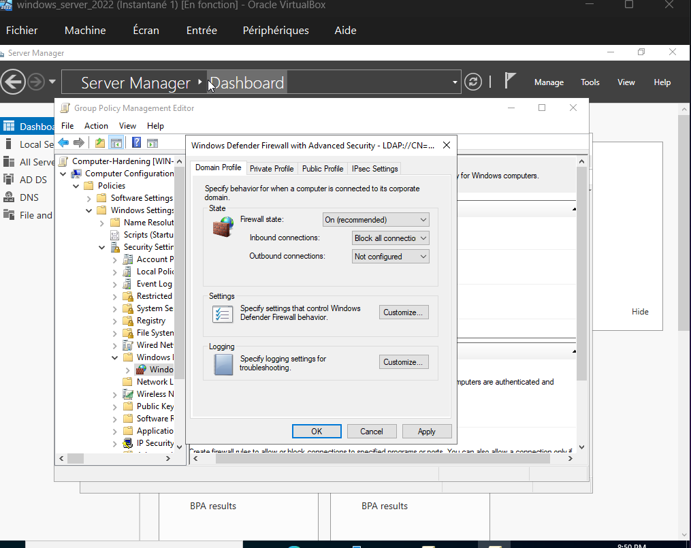

---

## 4. Conclusion
Phase 2 is now successfully completed. The infrastructure features a functional Active Directory domain with a robust security layer enforced by GPOs and advanced firewall rules.

**Status Summary:**
* [x] VMs & Network Configuration (Phase 1)
* [x] Domain Controller Promotion (Phase 2)
* [x] OU Structure & User Accounts (Phase 2)
* [x] **Full GPO & Firewall Hardening (Phase 2 - COMPLETED)**

**Next Steps:**
* Begin **Phase 3**: Perimeter Security (IDS/IPS) with OPNsense.
* Deploy and tune Zenarmor/Suricata rules.
---

## 5. Phase 3: Perimeter Defense & Hardening

**Objective:** Deploy and configure an Intrusion Detection/Prevention System (IDS/IPS) on the OPNsense firewall using **Suricata**, load Emerging Threats rulesets, simulate real attack scenarios, and tune rules to achieve active threat blocking.

---

### 5.1 Suricata IDS/IPS Configuration

Suricata was deployed directly on the OPNsense firewall via **Services > Intrusion Detection > Administration**.

**Key settings applied:**

| Parameter | Value |
| :--- | :--- |
| **Enabled** | ✅ Yes |
| **IPS Mode** | ✅ Enabled |
| **Promiscuous Mode** | ✅ Enabled |
| **Monitored Interfaces** | LAN, WAN |
| **Pattern Matcher** | Default |
| **Log Rotation** | Weekly |
| **Saved Logs** | 4 |

> Enabling **IPS mode** alongside **Promiscuous mode** allows Suricata to inspect all traffic passing through both interfaces, not just traffic destined for the firewall itself — ensuring full perimeter visibility.

**Proof of Suricata IDS/IPS Settings:**
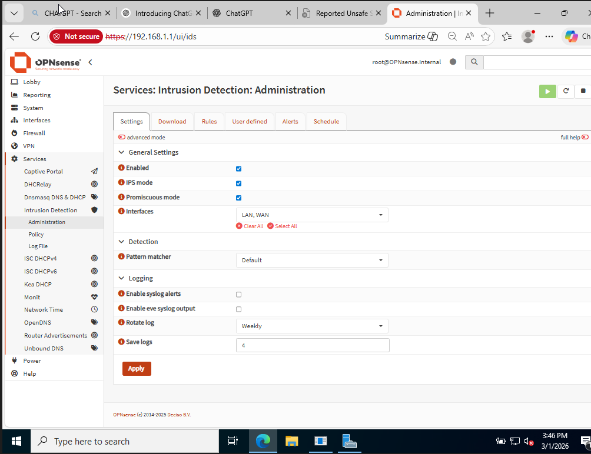

---

### 5.2 Ruleset Configuration (Emerging Threats)

Four **Emerging Threats (ET)** rulesets were loaded and applied via the **Policy** tab to cover the most common attack categories:

| Ruleset | Action | New Action |
| :--- | :--- | :--- |
| `emerging-malware.rules` | Alert | Alert |
| `emerging-scan.rules` | Alert | Alert |
| `emerging-attack_res.rules` | Alert | Alert |
| `emerging-policy.rules` | Alert | Alert |

Additional rule adjustments were configured to assign **Drop** actions to higher-severity signatures, enabling active packet blocking on confirmed threats.

**Proof of IDS Policy Configuration:**

**Proof of Rule Adjustments (Drop Actions):**

---

### 5.3 Attack Simulation & IDS Validation

To validate the detection capabilities of the deployed ruleset, a controlled **port scan simulation** was performed using **Zenmap (Nmap GUI)** from a Windows client on the internal network.

**Scan Parameters:**

| Parameter | Value |
| :--- | :--- |
| **Tool** | Zenmap (Nmap) |
| **Target** | `192.168.1.10` (OPNsense) |
| **Profile** | Intense Scan |
| **Command** | `nmap -T4 -A -v 192.168.1.10` |

The scan was executed from the Windows client (`192.168.1.134`) to trigger ET SCAN signatures within Suricata.

**Proof of Nmap Scan Execution:**

---

### 5.4 IDS Alert Analysis & Rule Tuning

The IDS alert log was monitored across three test sessions to track the evolution from initial detection to active blocking.

#### Stage 1 — Initial Detection (2026-02-25): Alerts Only

Upon first enabling the ruleset, Suricata correctly detected the scan traffic but only logged it as **`allowed`**. This confirmed that detection was working but that blocking had not yet been enforced.

- **SID:** `2024364` — *ET SCAN Possible Nmap/Scanning activity*
- **Source:** `192.168.1.134` → **Destination:** `192.168.1.1` (port 80)
- **Action:** `allowed` (detection only, IPS drop rules not yet tuned)
- **Total entries:** 8 alerts across 2 pages

**Proof — Stage 1 Alerts (Allowed):**
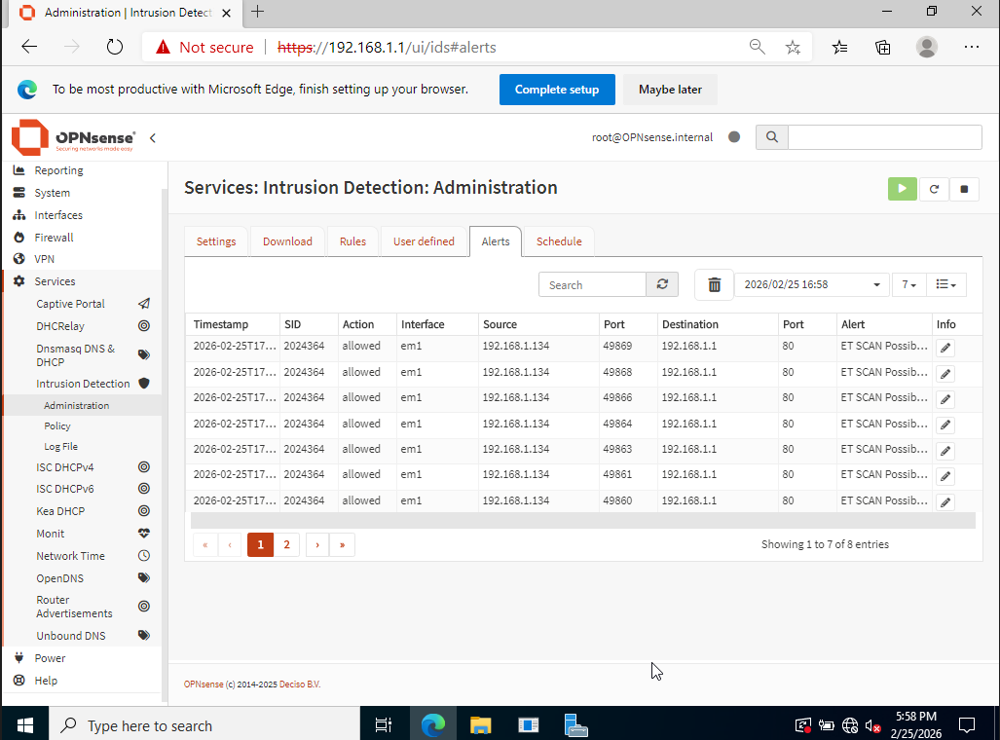

---

#### Stage 2 — Policy Traffic Baseline (2026-02-27): ET POLICY & USER_AGENT Alerts

A second session captured normal browsing traffic being flagged by the ET POLICY and ET USER_AGENT rulesets, confirming that **all traffic through both interfaces** (LAN + WAN) was being inspected.

- **SID `2018959`** — *ET POLICY* — flagged on both `em0` and `em1`
- **SID `2027390`** — *ET USER_AGENT* — external traffic to `184.29.81.254` monitored
- **Action:** `allowed` — traffic classified and logged for baseline profiling

**Proof — Stage 2 Alerts (Policy Baseline):**
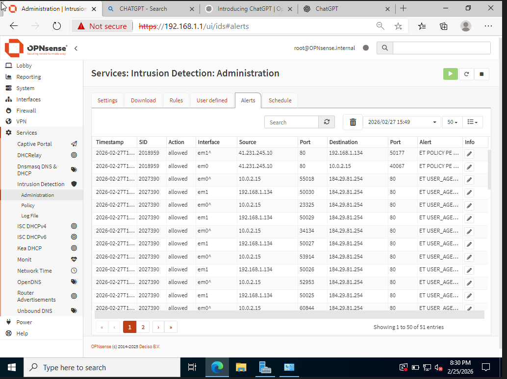

---

#### Stage 3 — Active Blocking (2026-03-01): IPS Rules Enforced ✅

After tuning the rule adjustments to assign **Drop** actions to scan-category signatures, the same Nmap scan was re-executed. Suricata now actively **blocked** the scan packets in real time.

- **SID:** `2024364` — same ET SCAN signature
- **Source:** `192.168.1.134` → **Destination:** `192.168.1.1` (port 80)
- **Action:** ✅ `blocked` — packets dropped at the perimeter
- **Total entries:** 51 blocked alerts across 2 pages

This confirms that the IPS pipeline is fully operational and that rule tuning successfully escalated detections from passive alerting to active prevention.

**Proof — Stage 3 Alerts (Blocked):**
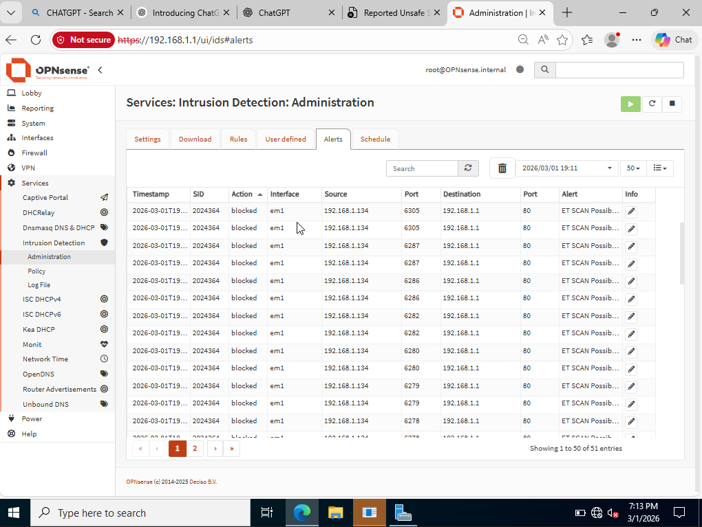

---

### 5.5 Summary

| Step | Action | Result |
| :--- | :--- | :--- |
| Suricata deployed on OPNsense | IPS + Promiscuous mode enabled on LAN & WAN | ✅ Active |
| Emerging Threats rulesets loaded | 4 ET rulesets: malware, scan, attack, policy | ✅ Applied |
| Attack simulation via Zenmap | `nmap -T4 -A -v` intense scan executed | ✅ Detected |
| Stage 1 — Initial alerts | Scan detected, action = `allowed` | ✅ Logged |
| Stage 2 — Policy baseline | ET POLICY/USER_AGENT traffic profiled | ✅ Logged |
| Stage 3 — Rule tuning applied | Drop rules enforced, scan = `blocked` | ✅ Blocked |

---

## 6. Conclusion

All three phases of the SOC infrastructure project have been successfully completed. The environment now features end-to-end security coverage: network segmentation at the firewall level (Phase 1), identity and policy enforcement via Active Directory and GPOs (Phase 2), and active perimeter threat detection and prevention via Suricata IDS/IPS on OPNsense (Phase 3).

**Final Status Summary:**

- [x] VMs & Network Configuration (Phase 1)
- [x] Domain Controller Promotion (Phase 2)
- [x] OU Structure, User Accounts & GPO Hardening (Phase 2)
- [x] **Suricata IDS/IPS Deployment & Rule Tuning (Phase 3 — COMPLETED)**

